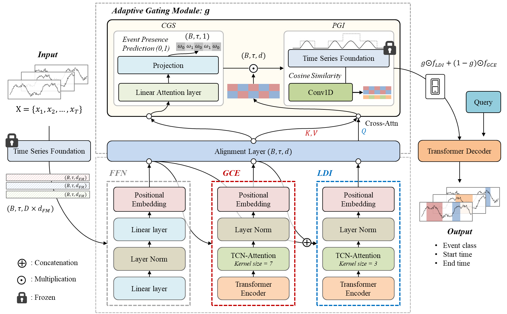
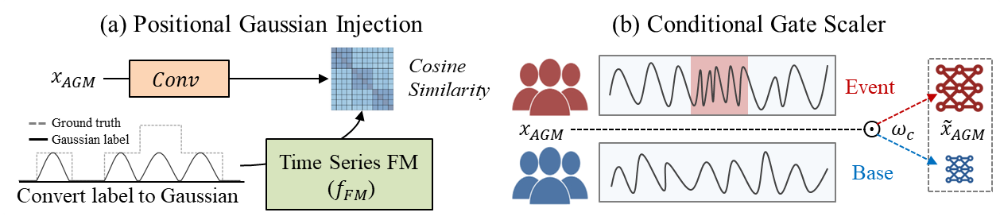

# Enhancing Sparse Event Detection in Healthcare Time-Series via Adaptive Gate of Context–Detail Interaction

## Our Paper

We propose an adaptive gating framework that improves sparse event detection in healthcare time-series by selectively fusing context and detail features. (ICLR 2026 Reviewing)

## Abstract

Accurate detection of clinically meaningful events in healthcare time-series data is crucial for reliable downstream analysis and decision support.
To address these challenges, we propose a coarse-to-fine detection framework combining a global context explorer, a local detail inspector, and an adaptive gating module (AGM) that fuses multiple label perspectives. The AGM uses transformed labels—encoding event presence and temporal position—to improve learning on sparse events. This design acts as a switch that selectively activates detailed feature extraction only when an event is likely, thereby reducing noise and improving efficiency in sparse settings.

## Framework

**Adaptive Gating Module**: A switch structure for context-detail interaction, specialized for sparse event detection, by viewing labels from diverse perspectives.

<p align="center">
  <table>
    <tr>
      <td align="center">
        
      </td>
      <td align="center">
        
      </td>
    </tr>
    <tr>
      <td align="center"><em>Figure 1. Overall Framework.</em></td>
      <td align="center"><em>Figure 2. Adaptive Gating Module (AGM).</em></td>
    </tr>
  </table>
</p>

## Result

Our model demonstrated effective detection of sparse events based on the interaction between long- and short-term dependencies. 
The interaction process and the resulting detection outcomes are as follows.

<p align="center">
  <table>
    <tr>
      <td align="center">
        
      </td>
      <td align="center">
        
      </td>
    </tr>
    <tr>
      <td align="center"><em>Figure 3. Context-Detail Interaction</em></td>
      <td align="center"><em>Figure 4. Prediction Result</em></td>
    </tr>
  </table>
</p>

## Requirements

```bash
numpy==1.24.4
pandas==2.3.1
scikit-learn==1.7.1
scipy==1.15.3
chronos-forecasting==1.5.3
torch==2.7.1+cu118
PyYAML==6.0.2
tqdm==4.67.1

